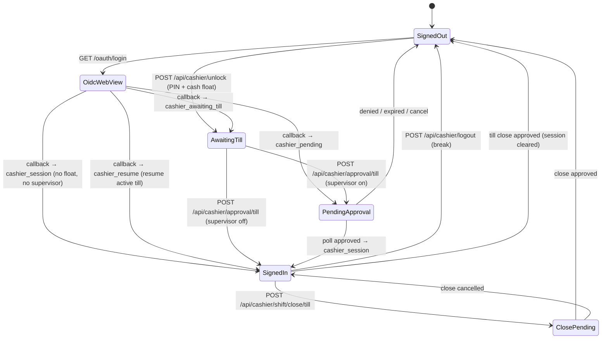

# POS session cookies & OIDC redirect state machine

Last updated: 2026-06-11

Canonical reference for **native tablet clients** (Android `android-pos`, future iOS `ios-pos`). The server issues HttpOnly cookies; native apps run OIDC in a WebView then bridge cookies into `URLSession` / OkHttp for REST calls.

**Source of truth (server):** `lib/cashier-auth.js`, `lib/oidc-pos.js`, `lib/awaiting-till-store.js`, `lib/session-store.js`, `lib/pos-client-kind.js`

**Source of truth (Android):** `MemoryCookieJar.kt`, `WebViewCookieSync.kt`, `CashierOidcWebScreen.kt`, `PosViewModel.kt`

---

## Overview

Three **cashier cookies** represent register auth state. At most one is meaningful at a time; issuing `cashier_session` clears the other two.

| Cookie | Purpose | Server store | TTL |
|--------|---------|--------------|-----|
| `cashier_session` | Active register — cart, checkout, till close | In-memory session map (`lib/session-store.js`) | **8 hours** (`DEFAULT_SESSION_MS`) |
| `cashier_pending` | Waiting for supervisor **till open** approval | `till_open_approvals` (ORDS) | **`CASHIER_APPROVAL_TTL_SEC`** (default **300s**) |
| `cashier_awaiting_till` | Post sign-in, **opening till count** not yet submitted | In-memory draft map (`lib/awaiting-till-store.js`) | **30 minutes** |

All three use: `Path=/; HttpOnly; SameSite=Lax` plus `Secure` when `CASHIER_SESSION_SECURE=true` (OCI HTTPS / tunnel).

Cookie values are URL-encoded tokens (session id or approval/draft token).

---

## Temporary OIDC cookie (browser flow only)

During Oracle sign-in the server also sets:

| Cookie | Purpose | TTL |
|--------|---------|-----|
| `oidc_pos_flow` | Binds OAuth `state` + `nonce` + `client_kind` + `register_id` | **600s** |

Cleared on `/oauth/callback`. Native clients do not need to read it — only the WebView participates in the redirect chain.

---

## High-level state machine



**SignedIn** means `cashier_session` is valid. Cart/checkout APIs require it (or POS bearer token — tablet uses cookies only).

---

## OIDC login URL

```http
GET /oauth/login?client_kind={kind}&register_id={id}&prompt=login
```

| Query param | Required (tablet/iOS) | Values |
|-------------|----------------------|--------|
| `client_kind` | Yes | `tablet` (Android), `ios` (iPad), `web` |
| `register_id` | Yes (tablet/iOS) | `tablet-{deviceStableId}` — one cashier per physical device |
| `prompt` | After break | `login` — force fresh IdP credentials |

Server stores `client_kind` and `register_id` in `oidc_pos_flow` and uses them in `/oauth/callback` (`lib/oidc-pos.js`).

**Register ID examples:**

- Android: `tablet-{ANDROID_ID}` (`TabletRegisterId.kt`)
- iOS (planned): `tablet-{identifierForVendor}`

---

## OIDC callback outcomes

After Oracle redirects to `/oauth/callback`, `onAuthenticated` in `lib/oidc-pos.js` runs **in this order**:

1. **Register guard** — `assertRegisterAvailable(registerId, cashierSub)` → **409** if another cashier holds an active till on this register.
2. **Resume active till** — same cashier + same register has `tills.status = active` → issue `cashier_session`, redirect with resume query param.
3. **Create POS session** — insert `pos_sessions` row (always for new sign-in).
4. Branch on config:

| Condition | Cookies set | HTTP redirect |
|-----------|-------------|-----------------|
| `OPENING_CASH_FLOAT` configured | `cashier_awaiting_till` (clears session + pending) | `/?awaiting_till=1` |
| `CASHIER_SUPERVISOR_APPROVAL=true` (no float step) | `cashier_pending` | `/?approval=pending&request_token={token}` |
| Neither | `cashier_session` | `/` (default success) |

When **both** cash float and supervisor approval are enabled, flow is: **awaiting till → submit count → pending → approved → session** (not direct to pending on callback).

---

## OIDC completion URL query params (native clients)

Native WebViews must **not** render server HTML. Treat these as OIDC-complete signals (`CashierOidcWebScreen.kt`):

| Query param | Meaning | Next client action |
|-------------|---------|-------------------|
| `awaiting_till=1` | Opening count required | Sync cookies → `GET /api/cashier/session` → `OpeningTill` gate |
| `approval=pending` | Supervisor till-open wait | Sync cookies; optionally read `request_token` → pin in cookie jar → `WaitingApproval` + poll |
| `request_token={token}` | Pending approval token (with `approval=pending`) | `rememberPendingRequestToken` if WebView cookie sync fails |
| `cashier_resume=1` | Resumed active till (`client_kind` `tablet` or `ios`) | Sync cookies → session probe → `SignedIn` |
| `resumed=1` | Same, for `client_kind=web` | (web POS only) |

**Completion detection:** URL must be under API host prefix. Also detect body text `"pending login approval"` as fallback when redirect query is missing.

---

## Cookie transitions (mutual exclusion)

| Event | Sets | Clears |
|-------|------|--------|
| Issue `cashier_session` | `cashier_session` | `cashier_pending`, `cashier_awaiting_till` |
| Issue `cashier_pending` | `cashier_pending` | `cashier_session` (and awaiting on OIDC path) |
| Issue `cashier_awaiting_till` | `cashier_awaiting_till` | `cashier_session`, `cashier_pending` |
| `POST /api/cashier/logout` | — | all three + end `pos_sessions` |
| `POST /api/cashier/sign-off` | — | all three + close till + end `pos_sessions` |
| Pending terminal (denied/expired/cancelled) | — | `cashier_pending` |
| Awaiting till expired / cancel | — | `cashier_awaiting_till` |

Android `MemoryCookieJar` pins the first non-expired value per cookie name and **clears pending/awaiting when session is set** — mirror this on iOS.

---

## Session probe: `GET /api/cashier/session`

Public endpoint (no `cashier_session` required). Evaluates cookies **in priority order**:

1. Valid `cashier_session` → `{ ok: true, tillId, posSessionId, cashMode, cashEnabled, … }`
2. Valid `cashier_awaiting_till` draft → `{ ok: false, awaitingTill: true, … }`
3. Valid `cashier_pending` + pending approval row → `{ ok: false, pending: true, approval: { … } }`
4. Else → `{ ok: false, pending: false, … }`

Base fields on every response:

```json
{
  "supervisorApprovalRequired": true,
  "idpEnabled": true,
  "idpLoginUrl": "/oauth/login",
  "pinAllowed": false,
  "cashTillEnabled": true,
  "expectedOpeningFloat": 200,
  "denominations": []
}
```

**Client rule:** After any OIDC redirect or approval poll success, call `GET /api/cashier/session` and branch on `ok` / `awaitingTill` / `pending` (`applySessionProbe` in `PosViewModel.kt`).

---

## PIN unlock (dev / no supervisor)

`POST /api/cashier/unlock` body: `{ "pin": "8930", "clientKind": "tablet" }`

Blocked when `CASHIER_SUPERVISOR_APPROVAL=true` or IdP-only without `IDP_ALLOW_PIN`.

| Config | Response | Cookie |
|--------|----------|--------|
| Cash float configured | `{ ok: true, awaitingTill: true }` | `cashier_awaiting_till` |
| No float | `{ ok: true }` | `cashier_session` |

Tablet clients should follow with `GET /api/cashier/session` (Android `unlockCashier` does this).

---

## Opening till submit

`POST /api/cashier/approval/till` — requires `cashier_awaiting_till` cookie.

| Supervisor approval | Result |
|-------------------|--------|
| On | Creates `till_open_approvals` row → `cashier_pending` → **202** `{ pending: true, pollUrl }` |
| Off | Creates till + `cashier_session` → **200** `{ ok: true }` |

Cancel: `POST /api/cashier/approval/till/cancel` clears awaiting cookie and draft.

Expired draft: **401** `{ error: "…", code: "AWAITING_TILL_EXPIRED" }`.

---

## Supervisor till-open poll

`GET /api/cashier/approval/status` — requires `cashier_pending` cookie (or POS bearer + matching pending row).

| `status` | Action |
|----------|--------|
| `pending` | Keep polling (Android: every 2.5s) |
| `approved` | Server sets `cashier_session` in response; client probes `/api/cashier/session` |
| `denied` / `expired` / `cancelled` | Clear cookies; return to sign-in |

Cancel wait: `POST /api/cashier/approval/cancel`.

Approval error codes (JSON `code` field): `APPROVAL_DISABLED`, `NO_PENDING`, `WRONG_CASHIER`.

---

## Break vs sign-off vs till close

| Action | Endpoint | POS session | Till (`tills` row) | Cookies |
|--------|----------|-------------|-------------------|---------|
| **Break** (Android UI) | `POST /api/cashier/logout` | **Ended** | Stays **active** | All cleared |
| **Sign-off** (API only on tablet) | `POST /api/cashier/sign-off` | Ended | **Closed** | All cleared |
| **EOD close** (supervisor flow) | `shift/close/*` | Ended on approve | Closed on approve | Cleared on approve |

**iOS must match Android:** menu “Break” → `logout`. “Close till” → close flow, not `sign-off`.

After break, same cashier signing in on same `register_id` hits **resume** path (`cashier_resume=1`) if till still active.

---

## Till close (session cookie only)

Close flow uses **`cashier_session` only** — no separate close cookie.

| Step | Endpoint |
|------|----------|
| Preview | `GET /api/cashier/shift/close/preview` |
| Submit count | `POST /api/cashier/shift/close/till` |
| Poll | `GET /api/cashier/shift/close/status` |
| Cancel | `POST /api/cashier/shift/close/cancel` |

On supervisor approve (or auto-approve when supervisor off): server ends `pos_sessions`, deletes session, clears all cashier cookies.

---

## POS session vs till (database)

Cookies gate HTTP access; database rows track business state:

| Concept | Table | Lifetime |
|---------|-------|----------|
| POS session | `pos_sessions` | One per cashier sign-in spell; ends on **break** (`logout`) or till close / sign-off |
| Till | `tills` | One per open→close cycle; **survives break**; same `till.id` across multiple POS sessions |

`cashier_session` payload includes `tillId` and `posSessionId` when till is open.

---

## Register-in-use guard

`lib/tills.js` → `assertRegisterAvailable`: if `register_id` has an active till for a **different** cashier, sign-in fails with **409** and message like “Register is in use”.

Native clients should clear cookies and show sign-in gate on 409 during till submit or OIDC.

---

## WebView → native cookie bridge

Oracle OIDC sets cookies in the WebView cookie store. REST clients use a separate jar — **sync is required**.

### Android (reference)

1. On OIDC complete: `WebViewCookieSync.sync(baseUrl, cookieJar)` — reads cookies for `/`, `/?approval=pending`, `/?awaiting_till=1`, `/?cashier_resume=1`, `/oauth/callback`.
2. Retry sync after 150ms.
3. If `request_token` in URL: `rememberPendingRequestToken` injects `cashier_pending` into OkHttp jar.
4. `MemoryCookieJar` pins `cashier_pending`, `cashier_awaiting_till`, `cashier_session` when CookieManager drops them.

### iOS (planned)

1. `WKHTTPCookieStore.getAllCookies` (or per-URL) after navigation completes.
2. Copy into `HTTPCookieStorage.shared` for `URLSession` **or** manual `Cookie` header injection.
3. Pin tokens in app memory when WKWebView sync is unreliable (same three names).
4. On break: clear WKWebView cookies (`clearIdpWebViewCookies` equivalent) + native jar + set `prompt=login` on next OIDC URL.

**URLs to scrape cookies from:** same list as Android `WebViewCookieSync.kt`.

---

## Native client gate mapping

Map `GET /api/cashier/session` (+ OIDC URL hints) to UI gates:

| Probe result | Gate |
|--------------|------|
| `ok: true` | SignedIn — load products/cart |
| `awaitingTill: true` | OpeningTill — `GET /api/cashier/till/config` |
| `pending: true` | WaitingApproval — poll `/api/cashier/approval/status` |
| else + IdP | PinSignIn or OidcSignIn |
| OIDC WebView open | OidcSignIn |

On cold start: `Checking` → probe session.

---

## Environment flags (summary)

| Variable | Effect on cookies/flow |
|----------|------------------------|
| `OPENING_CASH_FLOAT` | Enables `cashier_awaiting_till` step |
| `CASHIER_SUPERVISOR_APPROVAL` | Enables `cashier_pending` till-open (+ close) approval |
| `CASHIER_APPROVAL_TTL_SEC` | `cashier_pending` Max-Age (default 300) |
| `CASHIER_SESSION_SECURE` | `Secure` flag on all cashier cookies |
| `IDP_POS_*` | Enables OIDC; PIN blocked when supervisor on |

---

## Public vs protected APIs

**Public (no `cashier_session`):** `/api/cashier/session`, `/api/cashier/unlock`, `/api/cashier/logout`, `/api/cashier/sign-off`, `/api/cashier/till/config`, `/api/cashier/approval/*`, `GET /api/products`.

**Protected:** `/api/cart/*`, `/api/checkout`, `/api/cashier/shift/close/*`, etc. → **401** without valid `cashier_session`.

---

## Testing

| Test | Command / path |
|------|----------------|
| Session store unit | `npm test` → `test/session-store.test.js` |
| Approval poll E2E | `npm run test:cashier-approval-poll` |
| Manual tablet | OIDC → verify cookies in server logs; probe session |

---

## Related

- [ios-pos-port-plan.md](ios-pos-port-plan.md) — full port plan (P0–P5)
- [pos-client-identifiers.md](pos-client-identifiers.md) — `client_kind` + `register_id` (P0.2)
- [cashier-supervisor-approval.md](cashier-supervisor-approval.md) — supervisor Model B
- [cash-till-opening-and-close.md](cash-till-opening-and-close.md) — till denominations (legacy table names in places)
