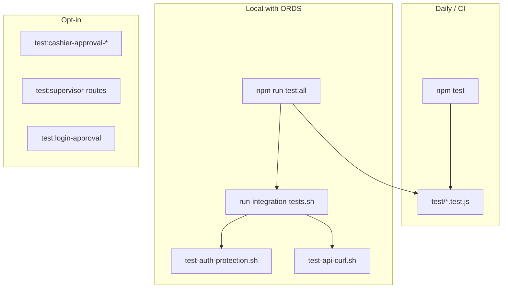

# Testing suite — cloud-store-893

How automated and manual tests are organized, how to run them, and what each layer covers.

**Related:** root [README.md](../README.md), [cashier-supervisor-approval.md](cashier-supervisor-approval.md) (Model B flows).

---

## Overview

The suite has three layers:

| Layer | Needs server? | Needs ORDS/ADB? | Mutates DB? | Default in CI? |
|-------|---------------|-----------------|-------------|----------------|
| **Unit** | No | No | No | Yes (every push/PR) |
| **Integration** | Ephemeral (auto-started) | Yes | Read-only by default | Optional (secrets) |
| **Manual / Model B** | Yes (your choice) | Yes | Sometimes | No |



There is **no automated Android/tablet test suite** yet. Tablet flows are validated manually against OCI or local dev.

---

## Quick start

From the repo root:

```bash
# Fast — no network, no ORDS (recommended before every commit)
npm test

# Full smoke — unit + auth + read-only API (needs ORDS_BASE_URL in .env)
npm run test:all

# Full smoke + cart clear + real checkout in ADB (destructive)
npm run test:all:destructive
```

Every `npm test` / `run-tests.sh` run ends with a **summary report**:

```
================================================================
  cloud-store-893 — test summary
================================================================
  Suite                    Pass   Fail   Skip    Time
  ----------------------------------------------------------------
  unit                       32      0      0      0s  PASS
  auth                       55      0      0      2s  PASS
  api                        12      0      0      1s  PASS
  ----------------------------------------------------------------
  TOTAL                      99      0      0      3s  PASS
================================================================
```

Exit code `0` = all suites passed; `1` = at least one failure.

Equivalent shell entry points:

```bash
./scripts/run-tests.sh
./scripts/run-tests.sh --integration
./scripts/run-tests.sh --integration --destructive
```

---

## npm scripts reference

| Command | What runs |
|---------|-----------|
| `npm test` | Unit tests + summary |
| `npm run test:unit` | Same as `npm test` |
| `npm run test:integration` | Ephemeral server + auth + API (no summary wrapper) |
| `npm run test:all` | Unit + integration + summary |
| `npm run test:all:destructive` | Unit + integration (with cart/checkout) + summary |
| `npm run test:auth` | Auth protection only (server must already be running) |
| `npm run test:api` | API curl tests only (server must already be running) |
| `npm run test:login-approval` | ORDS store smoke test (no HTTP server) |
| `npm run test:supervisor-routes` | Supervisor approval HTTP routes |
| `npm run test:cashier-approval-session` | Model B pending cookie + session probe |
| `npm run test:cashier-approval-poll` | Model B poll → approve → session E2E |

---

## Unit tests

**Location:** `test/*.test.js`  
**Runner:** Node.js built-in [`node:test`](https://nodejs.org/api/test.html) (no Jest/Mocha dependency).

| File | Module under test |
|------|-------------------|
| `session-store.test.js` | `lib/session-store.js` — cookies, TTL, `appendHeader`, secure flag |
| `session-cookies.test.js` | `lib/session-cookies.js` — `parseCookies` |
| `ords-client.test.js` | `lib/ords-client.js` — timestamp format, URL normalization, fetch errors |
| `approval-errors.test.js` | `lib/approval-errors.js` |
| `supervisor-config.test.js` | `lib/supervisor-config.js` |
| `cashier-identity.test.js` | `lib/login-approval.js` — `identityFromCashierSub`, `identityFromApproval`, claim helpers |

Run directly:

```bash
node --test test/*.test.js
```

Add new pure-logic tests here as shared `lib/*` helpers grow. Keep Express route tests in the integration layer unless you introduce a lightweight HTTP mock.

---

## Integration tests

**Orchestrator:** `scripts/run-integration-tests.sh`  
**Requires:** `ORDS_BASE_URL` in `.env` or environment; `curl`, `python3`, `node`.

### Ephemeral test server

When `BASE_URL` is not preset, the script:

1. Picks a free port on `127.0.0.1`
2. Starts `node server.js` with test-friendly env:

   | Variable | Test value | Why |
   |----------|------------|-----|
   | `CASHIER_SUPERVISOR_APPROVAL` | `false` | PIN unlock works in auth tests |
   | `CASHIER_SUPERVISOR_PIN_IS_SUPERVISOR` | `false` | Avoid supervisor PIN side paths |
   | `IDP_ALLOW_PIN` | `true` | PIN login available |
   | `DEV_PERSIST_AUTH_SESSIONS` | `false` | In-memory sessions only |
   | `BUILD_ID` | `integration-test` | Identifiable in logs |

3. Waits for `GET /api/cashier/session` → 200
4. Runs sub-suites
5. Stops the server on exit

Use an **existing** server instead:

```bash
BASE_URL=http://127.0.0.1:3000 ./scripts/run-integration-tests.sh
```

### Sub-suite: auth (`test-auth-protection.sh`)

Read-only HTTP checks:

- Public routes (`/api/products`, `/api/cashier/session`, logout) work without a session
- Protected POS and admin routes return **401** without a session
- Valid **cashier PIN** unlock grants POS access; cashier cookie does **not** grant admin
- Valid **admin PIN** grants admin access; admin cookie does **not** grant POS cart
- Bad PINs → 401
- IdP routes (`/oauth/login`, `/oauth/admin/login`) → 302 when configured, 404 when not

PINs: `CASHIER_PIN` / `ADMIN_PIN` from env or `.env` (default cashier PIN `8930`).

When Model B is **disabled** on the server under test, `GET /api/cashier/approval/status` → **404** (expected). When Model B is on and no pending cookie → **401**.

### Sub-suite: API (`test-api-curl.sh`)

Exercises POS cart and checkout routes via curl.

**Always runs (non-destructive):**

- `GET /api/build-info` — deploy smoke (`BUILD_ID` from Docker build or `integration-test` in CI)
- `GET /api/products`, unlock, customers, cart GETs, validation errors
- `POST /api/cart {}` → 400; `POST /api/cart {unknown productId}` → 404
- `POST /api/cart/barcode {}` → 400; unknown barcode → 404
- `GET /api/sales/recent`

**Destructive phase** (cart mutation + checkout) runs only when:

- Products exist in DB, **and**
- Destructive mode is enabled (`RUN_DESTRUCTIVE=yes` / `--destructive`), **and**
- You confirm by typing `yes`, unless `SKIP_CONFIRM=yes`

Destructive actions:

- Clears **all** cart lines (global shared cart)
- Adds lines by `productId` and by **live barcode** from first product in `GET /api/products`
- Deletes a line, completes checkout (creates a real sale in ADB)
- Verifies empty-cart checkout → 400

**Skip destructive work:**

```bash
SKIP_DESTRUCTIVE=yes ./scripts/test-api-curl.sh   # default in npm run test:all
```

---

## Manual / Model B scripts

Not part of `npm test` or `npm run test:all`. Run when working on supervisor approval (Model B).

| Script | Server env | What it verifies |
|--------|------------|------------------|
| `test:login-approval` | None (ORDS only) | `lib/login-approval.js` create/list/approve against live ADB |
| `test:supervisor-routes` | `CASHIER_SUPERVISOR_PIN_IS_SUPERVISOR=true` recommended | Admin approval list/approve/deny routes |
| `test:cashier-approval-session` | `CASHIER_SUPERVISOR_APPROVAL=true` | Pending cookie + `/api/cashier/session` shapes |
| `test:cashier-approval-poll` | Model B + supervisor PIN fallback | Full poll → approve → `cashier_session` cookie |

See [cashier-supervisor-approval.md](cashier-supervisor-approval.md#testing-manual-today) for step-by-step Model B manual testing.

Example:

```bash
CASHIER_SUPERVISOR_APPROVAL=true CASHIER_SUPERVISOR_PIN_IS_SUPERVISOR=true npm run dev:up
# separate terminal:
npm run test:cashier-approval-poll
```

---

## CI (GitHub Actions)

**Workflow:** `.github/workflows/test.yml`

| Job | Trigger | Command |
|-----|---------|---------|
| **unit** | Every push/PR to `main` or `dev` | `npm run test:unit` |
| **integration** | Push when `ORDS_BASE_URL` secret is set, or manual **workflow_dispatch** | `npm run test:integration` (read-only API) |

### Optional repo secrets (integration job)

| Secret | Required? | Notes |
|--------|-----------|-------|
| `ORDS_BASE_URL` | Yes for integration job | Same as local `.env` |
| `CASHIER_PIN` | No | Defaults to `8930` |
| `ADMIN_PIN` | No | Falls back to cashier PIN |

Integration CI does **not** run the destructive cart/checkout phase.

---

## Environment variables

| Variable | Used by | Purpose |
|----------|---------|---------|
| `BASE_URL` | curl scripts | Target server (default `http://127.0.0.1:3000`) |
| `ORDS_BASE_URL` | integration runner | Live ADB/ORDS |
| `CASHIER_PIN` / `ADMIN_PIN` | auth, API tests | Unlock/login |
| `SKIP_DESTRUCTIVE=yes` | `test-api-curl.sh` | Skip cart clear + checkout |
| `SKIP_CONFIRM=yes` | `test-api-curl.sh` | Auto-confirm destructive phase |
| `RUN_DESTRUCTIVE=yes` | integration runner | Enable destructive API tests |
| `VERBOSE=1` | `test-api-curl.sh` | Print response bodies on OK |

---

## OCI deploy verification (manual)

Not part of `npm test`. After `./scripts/oci/redeploy-app-code.sh`:

```bash
APP=$(./scripts/oci/oci-app-url.sh)
curl -s "$APP/api/build-info"                    # expect {"buildId":"<your BUILD_ID>"}
curl -s -o /dev/null -w "%{http_code}\n" \
  -X POST "$APP/api/cashier/unlock" \
  -H 'Content-Type: application/json' -d '{"pin":"8930"}'   # expect 200, not 404
```

Optional API smoke against the live server (read-only; needs cashier unlock in script):

```bash
BASE_URL="$APP" SKIP_DESTRUCTIVE=yes ./scripts/test-api-curl.sh
```

See [README.md](../README.md#update-the-oci-container-after-code-changes) and [oci-network-recovery.md](oci-network-recovery.md).

---

## Local dev + tablet (manual)

| Layer | Command | Notes |
|-------|---------|-------|
| Server | `npm run dev:up` | Probes ORDS; prints Mac LAN URL for tablet |
| Unit + integration | `npm test` / `npm run test:all` | Integration uses ephemeral server + dev ADB |
| Tablet APK | `cd android-pos && USE_LOCAL=1 ./RebuildReinstall.sh` | Bakes `API_BASE_URL` to Mac LAN IP |
| Oracle sign-in on tablet | `./scripts/oci/idp-update-redirect-uris.sh` | Register `http://<LAN_IP>:3000/oauth/callback` — not `localhost` |
| PIN-only local dev | `CASHIER_SUPERVISOR_APPROVAL=false` in `.env` | Avoids IdP redirect setup when testing cart flows |

Integration tests do **not** cover Android UI (e.g. add-item error display); validate tablet behavior manually.

---

## What is not covered

- **Android POS** (`android-pos/`) — no JVM/instrumented tests yet
- **Web POS / admin UI** — integration tests hit APIs and static admin pages, not browser JS
- **OCI deploy / Terraform** — use `./scripts/oci/redeploy-app-code.sh` + curl checks above; not in `npm test`
- **IdP OAuth redirect flows** — auth tests only check redirect status codes, not full Oracle login
- **Production OCI** — run integration against local ephemeral server + dev ADB, not `oci.cloudstore893.com`, unless you point `BASE_URL` there deliberately

---

## Troubleshooting

| Symptom | Likely cause | Fix |
|---------|--------------|-----|
| `ORDS_BASE_URL is not set` | Missing `.env` | Copy `.env.example`, set `ORDS_BASE_URL` |
| `POST /api/cashier/unlock → 403` | Model B on server | Use integration runner (forces approval off) or set `CASHIER_SUPERVISOR_APPROVAL=false` |
| `POST /api/cart/barcode → 404` on seed barcode | Empty products table | Run `scripts/seed.sql` in Database Actions |
| `POST /api/cart {productId} → 404` on valid-looking id | Product not in ADB | Expected for unknown ids; seed products or use id from `GET /api/products` |
| `POST /api/cart/barcode → 404` on unknown barcode | Expected | Non-destructive API test uses `does-not-exist-xyz` |
| Auth passes, API cart routes → 500 | ORDS down or schema not enabled | `npm run dev:up` probe; fix ORDS enablement |
| Summary shows `integration 0 1` | Sub-suite crashed before `== done (auth/api):` | Scroll up for server startup or ORDS errors |
| `invalid_redirect_uri` on tablet Oracle sign-in | LAN IP not in IdP redirect list | Run `idp-update-redirect-uris.sh` with `APP_PUBLIC_HOST=<Mac LAN IP>` |
| `curl build-info` shows `unknown` locally | No `BUILD_ID` at start | Normal for `npm run dev:up`; set `BUILD_ID=…` when testing deploy parity |
| Destructive test aborts | Interactive prompt | Use `SKIP_CONFIRM=yes` or `SKIP_DESTRUCTIVE=yes` |

---

## Adding tests

1. **Pure functions in `lib/`** → add `test/<module>.test.js`, run `npm test`.
2. **New HTTP route** → extend `scripts/test-auth-protection.sh` and/or `scripts/test-api-curl.sh` (prefer non-destructive checks in the read-only section).
3. **Model B behavior** → extend the opt-in scripts under `scripts/test-cashier-approval-*.sh`.
4. **OCI deploy** → document curl/`redeploy-app-code.sh` steps in this file; optional read-only `test-api-curl.sh` against live URL.
5. **CI** → unit tests run automatically; integration picks up changes to curl scripts when secrets are configured.

Keep destructive DB writes out of the default `npm run test:all` path so daily runs stay safe against shared dev ADB.
