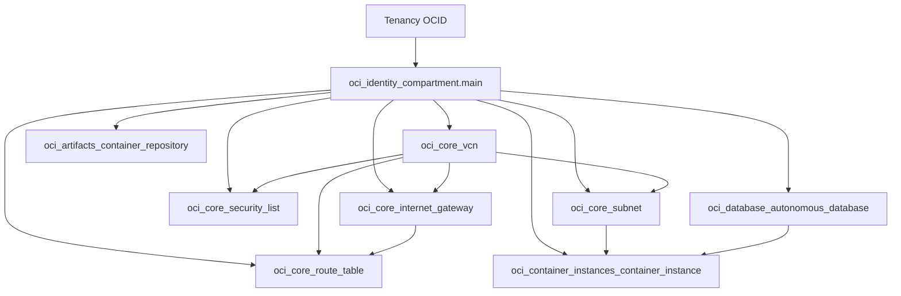

# Terraform — cloud-store-893

This directory is the **single IaC definition** for the cloud half of the project: one OCI compartment, networking, a public OCIR repository, an Always Free Autonomous Transaction Processing (ATP) database, and a Container Instance that runs the Node app and talks to ORDS.

Local app and tablet flows read values such as `ORDS_BASE_URL` from `.env`, while Terraform remains the source of truth for **where** the cloud resources live. Scripts like `npm run sync-env` rewrite `.env` from `terraform output`.

For a full **Terraform + Docker + DB seed** flow from the repo root, see [`../scripts/oci/deploy.sh`](../scripts/oci/deploy.sh) and the root [`../README.md`](../README.md).

OCI helper scripts live under [`../scripts/oci/`](../scripts/oci/) (deploy, app-only deploy, env sync, container restart, live URL, costs, IdCS redirects, state recovery).

---

## Files in this directory

| File | Purpose |
|------|---------|
| [main.tf](main.tf) | Terraform block (`required_version`, `oracle/oci` provider `~> 6.0`) and `provider "oci"` wiring from variables. |
| [variables.tf](variables.tf) | Auth, naming, OCIR, network, `app_port`, ADB password, `cashier_pin`, `admin_pin`. |
| [compartment.tf](compartment.tf) | One `oci_identity_compartment` under the tenancy. |
| [network.tf](network.tf) | VCN, internet gateway, route table (`0.0.0.0/0` → IGW), security list (SSH 22 + app port ingress, egress all), public subnet. |
| [registry.tf](registry.tf) | `oci_artifacts_container_repository` — **public** repo so the container instance can pull without an image pull secret. |
| [database.tf](database.tf) | Always Free ATP; `lifecycle { ignore_changes }` on OCPU/storage (API drift). |
| [container.tf](container.tf) | Container instance; env: `PORT`, `ORDS_BASE_URL`, `CASHIER_PIN`, `ADMIN_PIN`. |
| [outputs.tf](outputs.tf) | OCIDs, `app_url`, `ocir_image_path`, `ords_base_url`, etc. |
| [terraform.tfvars.example](terraform.tfvars.example) | Template for secrets and tenancy-specific values — copy to `terraform.tfvars` (gitignored). |

**State:** Default local backend (`terraform.tfstate` in this directory). That file and `.terraform/` are **gitignored**; do not commit state or `terraform.tfvars`.

---

## Prerequisites

1. **Terraform** — `brew install terraform`
2. **OCI API key** — OCI Console → Profile → My Profile → API Keys → Add API Key
   - Download the private key to `~/.oci/oci_api_key.pem`
   - The console shows your `tenancy_ocid`, `user_ocid`, and `fingerprint` after creation
3. **Docker image in OCIR** — the container instance needs an image at startup. The exact image path is printed by `terraform output ocir_image_path` after apply (see [Deploy](#deploy-manual) for ordering).

---

## Setup

```bash
cd terraform

# Install the OCI provider
terraform init

# Create your tfvars file
cp terraform.tfvars.example terraform.tfvars
# Edit terraform.tfvars with your OCI credentials and namespace
```

---

## Deploy (manual)

```bash
terraform plan   # preview what will be created
terraform apply  # create all resources (~5–10 min for ADB provisioning)
```

**Image ordering:** the **container** needs an **image** in OCIR. Typical options: a **two-phase** flow (same idea as [`../scripts/oci/deploy.sh`](../scripts/oci/deploy.sh) — registry + compartment first, build/push, then full apply), or apply once to create the repo, push the image, then apply again so the instance can pull.

```bash
docker buildx build --platform linux/arm64 -t <ocir_image_path> .
docker push <ocir_image_path>
```

Use `terraform output ocir_image_path` for `<ocir_image_path>` after the first apply.

---

## Deploy (`scripts/oci/deploy.sh`)

[`../scripts/oci/deploy.sh`](../scripts/oci/deploy.sh) automates a **two-phase** apply:

1. **Phase 1 — targeted apply:** `oci_identity_compartment.main` + `oci_artifacts_container_repository.main` so the registry exists.
2. **Docker** build/push for `linux/arm64` to the image path derived from `terraform.tfvars`.
3. **Phase 2 — full apply:** entire stack including VCN, ADB, and container instance.

That ordering avoids the container failing immediately on a missing image.

**App code only (keeps IP):** [`../scripts/oci/redeploy-app-code.sh`](../scripts/oci/redeploy-app-code.sh) — build, push, restart, verify. For a new tag via apply: [`../scripts/oci/deploy-app-oci.sh`](../scripts/oci/deploy-app-oci.sh).

---

## Outputs and repo integration

Example values after apply:

```
app_url                  = "http://<public-ip>:3000"
ocir_image_path          = "iad.ocir.io/<namespace>/cloud-store:latest"
ords_base_url            = "https://xxxx-CLOUDSTORE893.adb.us-ashburn-1.oraclecloudapps.com/ords/admin"
container_instance_ocid  = "ocid1.containerinstance..."
```

| Output | Typical use |
|--------|-------------|
| `compartment_ocid` | Identify the long-lived compartment in OCI. |
| `container_instance_ocid` | Shell helpers / `CLOUD_STORE_OCID` in `~/.zshrc` (see root README). |
| `app_url` | `http://{public_ip}:{app_port}` — cart app. |
| `ocir_image_path` | Exact `docker tag` / `docker push` target. |
| `ords_base_url` | ORDS admin base — synced into `.env` as `ORDS_BASE_URL` via `npm run sync-env` / [`../scripts/sync-env.sh`](../scripts/sync-env.sh). |
| `adb_ocid`, `vcn_ocid` | Support, console deep links, debugging. |

[`../scripts/dev-up.sh`](../scripts/dev-up.sh) compares `.env`’s `ORDS_BASE_URL` to `terraform output -raw ords_base_url` and warns on drift.

**After first apply:**

- Copy `ords_base_url` → update your `.env` file and `Dockerfile` ENV
- Copy `container_instance_ocid` → add `export CLOUD_STORE_OCID="..."` to `~/.zshrc`

---

## Dependency graph (conceptual)



- **Compartment** is the parent for every managed resource.
- **Container instance** depends on the **subnet** (VNIC) and reads **ADB connection URLs** for `ORDS_BASE_URL` in container env (see `locals.ords_base_url` in [container.tf](container.tf)).
- **Container image** is referenced as `local.image_path`: `{ocir_region_key}.ocir.io/{namespace}/{project_name}:{tag}` — the OCIR **repository** must exist; the image must be pushed separately (Docker).

---

## Variables and secrets

- **OCI API auth** is supplied only via `terraform.tfvars` (never committed). Paths and OCIDs are documented inline in [terraform.tfvars.example](terraform.tfvars.example).
- **`adb_admin_password`** is `sensitive` in Terraform; it is still stored in state after apply (normal Terraform behavior — protect state files accordingly).
- **`object_storage_namespace`** is required for the OCIR hostname segment.
- **`project_name`** drives the compartment **name**, OCIR repo **display name**, and many resource display names (default `cloud-store`).
- **`cashier_pin`** (sensitive, default `8930`) — tablet `POST /api/cashier/unlock`.
- **`admin_pin`** (sensitive, optional) — admin UI; defaults to `cashier_pin` when empty.

---

## Troubleshooting: `terraform apply` and Always Free ADB

If apply fails with:

`403-Forbidden … Always Free Autonomous … Upgrade this database to use this feature`

while updating `oci_database_autonomous_database`, Terraform is trying to change
**OCPU or storage** on an existing Always Free instance (common drift: `cpu_core_count` 0 vs 1).

**Fix in repo:** [database.tf](database.tf) includes:

```hcl
lifecycle {
  ignore_changes = [cpu_core_count, data_storage_size_in_tbs, is_auto_scaling_enabled]
}
```

After that, `terraform plan` should show **container instance only** (1 to add), not ADB changes.

**Always push a fresh Docker image** before apply when updating app code:

```bash
IMAGE=$(terraform output -raw ocir_image_path)
docker buildx build --platform linux/arm64 -t "$IMAGE" ..
docker push "$IMAGE"
terraform apply
```

Recreating the container instance may change **`app_url` public IP** — reattach the reserved IP and refresh `CLOUD_STORE_OCID` ([docs/oci-network-recovery.md](../docs/oci-network-recovery.md)). Tablet rebuild is usually unnecessary when using `oci.cloudstore893.com`.

---

## Network recovery after instance replace

Terraform replace assigns a **new ephemeral IP**; the **reserved public IP does not reattach automatically**.

- **Automated:** `./scripts/oci/reattach-reserved-ip.sh` — post-apply hook on `deploy-app-oci.sh` / `terraform-apply-container.sh` (`--recover-network`)
- **Manual CLI reference:** [docs/oci-network-recovery.md](../docs/oci-network-recovery.md)
- **Safe for code-only deploys:** `docker push` + `./scripts/oci/restart-container-instance.sh` (no instance replace)

---

## Tear down workloads (compartment is kept)

The compartment resource [compartment.tf](compartment.tf) `oci_identity_compartment.main` is deliberately **long-lived**:

- `lifecycle { prevent_destroy = true }` — Terraform refuses a plan that would destroy it.
- `enable_delete = true` — if you ever remove it from configuration/state and delete it in OCI, OCI allows compartment deletion (contrast with compartments that block delete).

**Workloads** (VCN, subnet, security list, route table, internet gateway, OCIR repo, ADB, container instance) are separate resources; tearing them down resets the cloud while keeping the same compartment name/OCID.

A plain **`terraform destroy`** plans to destroy **every** resource in state, **including** the compartment, so Terraform **rejects the plan** (nothing is destroyed). Use the helper script instead:

```bash
# from repo root — targets come from `terraform state list` (no hardcoded list)
./scripts/oci/terraform-destroy-workloads.sh
# preview only:
./scripts/oci/terraform-destroy-workloads.sh --plan-only
# CI / non-interactive:
./scripts/oci/terraform-destroy-workloads.sh --yes
```

This removes **all state-tracked workloads** except **data sources** and **`oci_identity_compartment.main`** (including `module.*.oci_identity_compartment.main` if you modularize). New Terraform resources are picked up automatically when they appear in state. If you add another resource that **must never** be destroyed, extend the exclusion logic in that script.

**Deleting the compartment itself** is intentionally **out of band** (OCI Console): repo automation does not remove the compartment from Terraform state.

Destroy order is handled by Terraform’s dependency graph.

---

## State recovery (workloads only)

[`../scripts/oci/terraform-recover-workload-state.sh`](../scripts/oci/terraform-recover-workload-state.sh) removes **workload** resource addresses from Terraform **state** only (no OCI API deletes). The compartment address is **never** removed. Use when resources are orphaned or stuck in state after drift or console changes; then `terraform plan` / `terraform apply` to reconcile.

---

## Troubleshooting: `404` / `NotAuthorizedOrNotFound` on `UpdateCompartment`

If **`terraform apply`** or **`scripts/oci/deploy.sh`** fails when **modifying** `oci_identity_compartment.main` with:

`Error: 404-NotAuthorizedOrNotFound ... UpdateCompartment`

then **that compartment OCID no longer exists in OCI** (deleted, or still deleting), but **Terraform state still tracks it**, or the API rejects an in-place update. Workload-only state recovery does **not** remove the compartment from state — reconcile in the OCI console or Oracle support if the compartment is truly gone.

**Fix workloads in Terraform state only** (compartment entry is left unchanged), from the **repository root**:

```bash
./scripts/oci/terraform-recover-workload-state.sh
cd terraform && terraform plan && terraform apply
```

If the compartment resource is orphaned (OCI 404) while still in state, fix that outside these scripts (console / support); **do not** `terraform state rm oci_identity_compartment.main` from repo automation.

---

## Security, quotas, and other notes

- **Security list** in [network.tf](network.tf) allows **SSH (22)** and the **app port** from `0.0.0.0/0` — appropriate only for demos or tightly controlled environments; tighten for production.
- **OCIR repository** is **public** (`is_public = true`) so pulls from the container instance do not need vault secrets for registry auth in Terraform; image updates remain a Docker/OCI concern.
- **ADB provisioning** takes **3–5 minutes** — `terraform apply` will wait.
- **Always Free limits** — your tenancy can only have 2 ADB Always Free instances and limited A1 OCPUs. If apply fails with a quota error, check the OCI Console.
- **terraform.tfvars is gitignored** — it contains your ADB admin password. Never commit it.
- **OCIR image before full apply** — on a fresh setup, run apply once (creates the registry repo), push your image, then re-run apply so the container instance can pull.

---

## Version pins

- Terraform: `>= 1.5` ([main.tf](main.tf)).
- OCI provider: `oracle/oci` `~> 6.0`.

After provider upgrades, re-run `terraform init -upgrade` from this directory.
